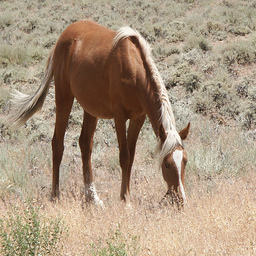
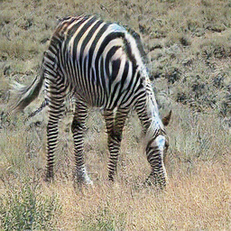
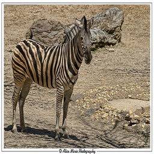
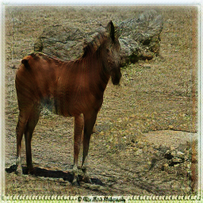

# CycleGan
CycleGan is an approach for learning to translate an image from a source domain X to a target domain Y in the absence of paired examples. The goal is to learn a mapping G: X → Y, such that the distribution of images from G(X) is indistinguishable from the distribution Y using an adversarial loss.

## Dataset
The network has been trained on the "Horse2Zebra" dataset, downloaded from Kaggle. The folder hierarchy of the dataset must be the following:  

<pre>
├───data  
│   └───train  
│   |   └───horses
|   |   └───zebras
│   └───val
│   |   └───horses
|   |   └───zebras
│   └───test
│       └───horses
│       └───zebras
</pre>

## Results
Horse to zebra:  
  ->     

Zebra to horse:  
  ->  
