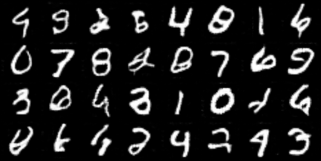
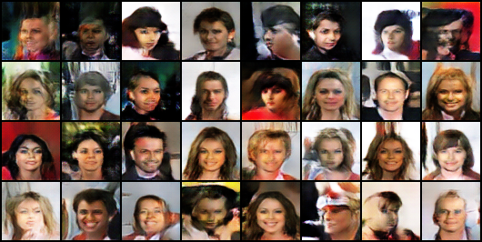
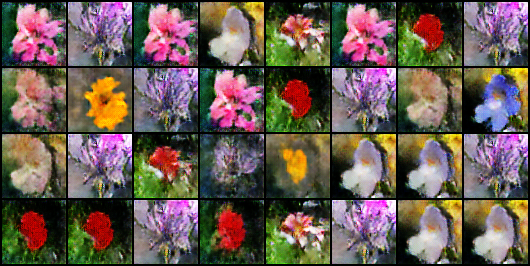

# DCGan

A DCGAN is a direct extension of the GAN described above, except that it explicitly uses convolutional and convolutional-transpose layers in the discriminator and generator, respectively. It was first described by Radford et. al. in the paper "Unsupervised Representation Learning With Deep Convolutional Generative Adversarial Networks".

# Dataset
Our DCGan implementation allows for the training on three different datasets, all present in the `torchvision.datasets` pytorch module . When one dataset is selected, it is automatically downloaded, if not already present, and put in the correct folder.
The three datasets are:  
* MNIST dataset: handwritten digits.
* CelebA dataset: large-scale face attributes dataset with more than 200K celebrity images, each with 40 attribute annotations.
* Flower102 dataset: category dataset, consisting of 102 flower categories occuring in the United Kingdom. Each class consists of between 40 and 258 images.

# Results
   (MNIST dataset)
  (CelebA dataset)
  (Flower102 dataset)