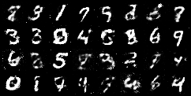

# Gan

Class of ML techniques first introduced by Ian Goodfellow et al. - 2014.  
The objective is the one of generating fake data that resembles the original to the point of being indistinguishable.
In particular, it consists of two NNs (the generator and the discriminator) that are trained one against the other.

## Dataset
The simple Gan implementation relies on the MNIST dataset which is automatically downloaded and put in the correct folder. It is a database of handwritten digits which has a training set of 60,000 examples, and a test set of 10,000 examples.

# Results
