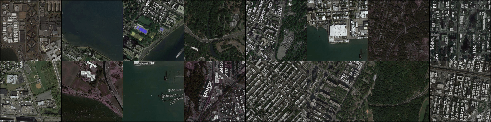
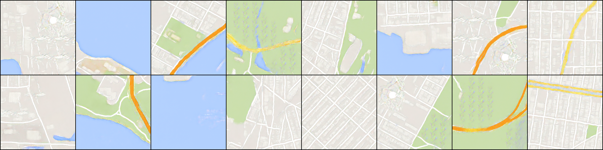

# Pix2Pix  
Pix2Pix is a Generative Adversarial Network, designed for general purpose image-to-image translation.
It implements a generator with a “U-Net”-based architecture and a discriminator that consists in a convolutional “PatchGAN” classifier, which only penalizes structure at the scale of image patches.  
This approach was first presented by Phillip Isola, et al. in 2016, in the paper titled “Image-to-Image Translation with Conditional Adversarial Networks” and presented at CVPR in 2017.

## Dataset
The network has been trained on the "maps" dataset, downloaded from Kaggle.  
The folders containing the dataset must follow the following hierarchy:

<pre>
├───data  
│   └───maps  
│       └───test
|       └───train
│       └───val
</pre>

## Results
Real:
Generated image:
Real target: